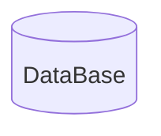

# Django-React Task List

Simple task list app for practice with Python Django and Django-Rest-Framework, JavaScript React, PostGreSQL, and Docker. 

```mermaid
flowchart TD
db1[(DataBase)]
```
- User Table
- Task table
